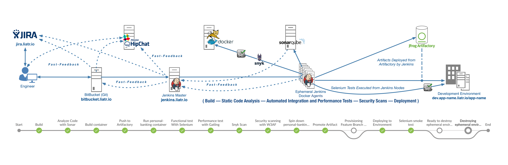

# Personal Banking Demo Application
### Demo Application Pipeline 


#### Running Personal Banking Demo Application Locally
```
    git clone http://bitbucket.liatr.io/scm/ub/personal-banking.git
    mvn tomcat7:run
```

You can then access the application at [http://localhost:9966/personal-banking/](http://localhost:9966/personal-banking/).

#### Tools & Instances
* [Artifactory](http://artifactory.liatr.io/)
* [Confluence](http://confluence.liatr.io/)
* [Dev. Environment](http://dev.personal-banking.liatr.io/personal-banking)
* [Jenkins](http://jenkins.liatr.io/)
* [JIRA](http://jira.liatr.io/)
* [Slack](http://liatrio-demo.slack.com/)
* [SonarQube](http://sonarqube.liatr.io/)

#### Pipeline Stages

##### Build

This stage builds the application using Maven.
1. Jira ticket is consumed from commit and url to jira ticket is specified.
1. Maven docker container is spun up to build inside
1. `mvn clean install` packages war, runs unit tests, generates jacoco code coverage report

##### Static Code Analysis
This stage uses SonarQube to perform static code analysis and gather metrics.
1. Using sonar tool installed on jenkins, reports from sonar.properties file is passed to sonar

##### Build Docker Image
This stage builds the docker container
1. Docker build reads from the `Dockerfile` at the root which specifies to copy the generated war into the `/usr/local/tomcat/webapps/` directory
2. The version of the container is pulled from the version of the war stated in the pom file.  

##### Push to DockerHub
This stage pushes the Docker image that we just created to the official DockerHub registry.
1. Using credentials stored on jenkins, logs into dockerhub
2. Pushes up built container to dockerhub

##### Run Docker Container
This stage runs the container locally so tests can run against it
1. Spins down any container with the name "personal-banking" so there no collisions
1. Spins up newly built container and names it personal-banking

##### Run Selenium Functional Tests
This stages runs functional tests to verify the application is running correctly
1. This stages runs functional tests against the running application in docker
1. tests are located in `regression-suite` directory
1. Spins up a maven container to run the tests from since they're run and managed by maven
1. Uses cucumber feature files to call selenium test cases


##### Load Testing
This stage uses Gatling to perform load tests against the running application container.
1. Spins up a gatling container as a build agent
1. runs tests located in BasicSimulation

##### Security Scanning
This stage uses the Web Application Audit & Attack Framework to perform security tests against the running application container.
1. Spins up a baked w3af container with a port scanning configuration
1. runs port scan

##### Stop Docker Container
Once all the integration tests are complete, the application container get spun down.
1. Removes container named 'personal-banking'
1. Notifies the slack channel that all the test have passed

##### Deploy Application Container
This stage deploys the app container to `pre-prod`
1. Deploys the new version by doing a docker pull
2. Stops the current running version
3. Releases the new version by running that container

##### Runs Smoke Test
1. Runs a simple smoke test to verify that the application running
1. Notifies slack channel that application is up

## Re-skinning the app

A ruby script, along with template files for the application have been created to easily allow the re-skinning of the application.
The simplest way to get a new UI for the app is to add images to the `src/main/webapp/resources/images/` then reference them in facade.yml.<theme> file.
All of the configuration necessary should be set in the yaml file, then processed with the included scripts. A reference for the expected yaml file structure and contents is located in
`facade.yaml.example`

#### Running scripts

Once you have filled out the yaml file for your theme, you will need to process it using the included ruby scripts. *This will overwrite your CSS and welcome.jsp files*.
To process the yaml, simply run `ruby tf-configs/facade.rb`

You may need to install some gems if you are using an old version on ruby, but this should not be the case in general
